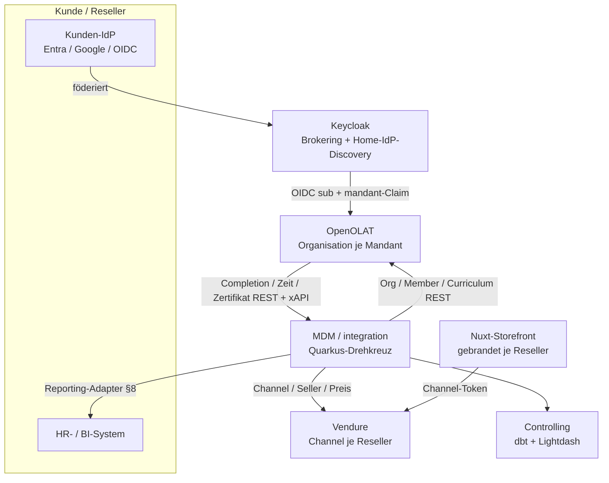

# Mandantenfähige Vermarktung von EBZ-eLearning (OpenOLAT)

> **Zweck dieses Dokuments:** vollständiger Architektur- und Umsetzungsplan, wie EBZ seine
> eLearning-Inhalte **mandantenfähig** vermarktet — an Enterprise-Kunden (Festpreis/Seats) **und** an
> White-Label-Reseller (B2B2C). Aufsetzend auf der bestehenden LMS-Anbindung (OpenOLAT, SSO Keycloak,
> Vendure, MDM/integration).
> **Stand:** 2026-06-24 · **Status:** **Planung — kein Code freigegeben.** Geschäftsmodell (R+E) und
> SSO-Weg (Keycloak-Brokering) sind abgestimmt; der **Reporting-/Nachweis-Teil ist Optionsraum und mit
> den Enterprise-Kunden abzustimmen** (siehe §8). Rechtliche/lizenzrechtliche Aussagen = Recherchestand,
> vor Realisierung final prüfen.

> **Fokussierter PoC (2026-06-25):** Die gebaute Teilmenge dieses Plans (Typ E, OpenOLAT shared, ohne
> Reseller/Reporting-Ausspielung) ist eigenständig beschrieben in
> [PoC-OpenOLAT-Mandanten-Integration.md](PoC-OpenOLAT-Mandanten-Integration.md) — misst gezielt den
> **Eigenbau-Aufwand der Mandanten-Schicht** als Entscheidungs-Evidenz (vgl.
> [LMS-Plattformvergleich §12.2](LMS-Plattformvergleich-OpenOLAT-Moodle.md); Moodle Workplace geparkt,
> IOMAD-Spike bei Kollegen).

**Reifegrad-Legende:** 🟢 vorhanden & nutzbar · 🟡 in Arbeit · ⚪ geplant/offen

---

## 1. Ausgangslage (Ist-Stand)

Die LMS-Strecke ist heute **ein-mandantig**: EBZ verkauft eigene WBTs an eigene Kunden.

| Baustein | Stand | Funktion |
|---|:--:|---|
| OpenOLAT 20.1 (Tomcat/JDK17), eigene DB `openolat` | 🟢 | LMS/Delivery-SoR, SCORM-1.2-Inhalte |
| Keycloak SSO (`ebz-customers`, `ebz-staff`) | 🟢 | Identität, JIT-User per OIDC-`sub` |
| `WbtKurs` (MDM) + Shop-Projektion | 🟢 | Katalog-SoR, Veröffentlichung nach Vendure |
| Vendure (Default-Channel) | 🟢 | Commerce, verkauft „Kurs-Zugang" |
| `Kurseinschreibung` (Outbox) → `OpenolatProvisioning` | 🟢 | idempotentes Einschreiben per REST, Retry/HITL |
| Portal „Meine Trainings" + SSO-Launch | 🟢 | kontext-skopierte Trainingsliste |
| Nuxt-SSR-Storefront, EBZ-gebrandet | 🟢 | redet server-seitig mit Vendure |

**Lücke:** keine Mandantentrennung — keine eigenen Marken, keine fremden Lernenden-Pools, kein
Festpreis-/Seat-Modell, keine Föderation fremder Identitäten, kein mandanten-bezogener Nachweis.

---

## 2. Ziel & zwei Mandanten-Typen

Ein **generalisiertes `Mandant`-Modell** (`vertragsTyp`), gemeinsamer Kern, zwei Vertriebsformen:

| | **Typ E — Enterprise-Flatrate** | **Typ R — Reseller (B2B2C)** |
|---|---|---|
| Vertrieb | **kein Shop** (Offline-Festpreisvertrag) | eigener **gebrandeter Storefront** |
| Commerce | **kein Vendure** nötig | Vendure-Channel je Mandant, per Kurs |
| Frontend | **nur OpenOLAT** (kein Storefront/Portal) | Storefront (+ Portal) |
| Zugang | **gesamter Katalog**, N Seats Festpreis | gekaufte Einzelkurse |
| Identität | **eigener Kunden-IdP** (föderiert) | `ebz-customers` + Tenant-Marker |
| Provisionierung | Bulk: Org + IdP-Federation + Voll-Katalog-Grant + Seat-Cap | Kauf → Einschreibung |
| Faktura | Lizenzvertrag → bestehende Rechnungs-Strecke | Shop-Order + Revenue-Share |

**Bau-Reihenfolge (abgestimmt):** Typ E zuerst, danach Typ R.

---

## 3. Tragende Architektur

**Mandant = MDM-first-class** (`Party-Organisation` + `Mandant`-Profil), projiziert auf native
Mechanismen — je System genau eines, **eine** OpenOLAT-/Vendure-Instanz (kein Instanz-pro-Mandant).

| Belang | Mechanismus | Typ | Beleg |
|---|---|:--:|---|
| Identität | Keycloak **Identity Brokering** + Home-IdP-Discovery (E-Mail-Domäne) → `mandant`-Claim | E | Keycloak-Brokering, Home-IdP-Discovery-Plugin |
| Delivery | **OpenOLAT-Organisation** je Mandant; Lernende JIT in Org; Repo-/Curriculum-Zugang scoped | E + R | OpenOLAT REST kann users/groups/**organisations**/curricula |
| Commerce | **Vendure-Channel** (Seller) je Mandant; channel-Katalog + -Preise; Revenue-Share | R | Vendure Channels = Multi-Tenant/Marketplace |
| Marke | **R:** Storefront-Ebene (Nuxt, Host→Branding). **E:** OpenOLAT-Branding via **Org-Typ-CSS-Klasse** (globales Theme) + **Keycloak-Login-Theme** pro Realm (§7.1) | E + R | OpenOLAT: kein Theme pro Org nativ, aber CSS-Klasse pro Org-Typ |

---

## 4. Identität — Keycloak Identity Brokering (gesetzt)

OpenOLAT bleibt bei **einem** OIDC-Provider (`ebz-customers`). Pro Mandant wird dessen IdP
(Entra ID, Google Workspace, eigenes Keycloak/ADFS, generisches OIDC/SAML) in Keycloak als **brokered
Identity Provider** eingehängt. **Home-IdP-Discovery per E-Mail-Domäne** (`@kunde.de` → dessen IdP;
`kc_idp_hint` bzw. Plugin `sventorben/keycloak-home-idp-discovery`) leitet Mitarbeiter automatisch
dorthin. Ein IdP-Mapper setzt Claim **`mandant=<schluessel>`** → OpenOLAT-Org-Zuordnung beim JIT-Login.

- Keycloak-Provisionierung über **Quarkiverse `quarkus-keycloak-admin-rest-client`**, token-gated wie
  die übrigen Real-Adapter; ohne Token Mock.
- Vorteil: OpenOLAT-Config unverändert/zentral, skaliert auf beliebig viele Mandanten. Konsistent mit
  der gesetzten „Keycloak = SSO-Hub"-Architektur (den *Kunden*-Entra zu föderieren ist genau Brokering).

---

## 5. Datenmodell — Package `mandant` (neu), Schema `mdm`, echte FKs

Kein neues Schema. Geld = Integer Cent, Enums als String-Spalten.

- **`Mandant`** — `organisation`(→FK Party-`Organisation`), `schluessel`(unique), `anzeigeName`,
  **`vertragsTyp`** (RESELLER | ENTERPRISE_FLAT), `status` (ENTWURF | AKTIV | INAKTIV),
  `openolatOrganisationKey?`; *R-Felder:* `vendureChannelId/Token?`, `vendureSellerId?`,
  `margeProzent?`, Branding `logoUrl/primaerFarbe/domain?`.
- **`IdpFoederation`** (E) — `mandant`(→FK), `idpAlias`, `emailDomains` (Liste), `protokoll`
  (OIDC | SAML), `status`. Quelle der Keycloak-Brokering-Provisionierung.
- **`Lizenzvertrag`** (E) — `mandant`(→FK), `seatLimit`, `laufzeitVon/Bis`, `festpreisCent`,
  `katalogUmfang` (ALLE | AUSGEWAEHLT), `status` → triggert Rechnung (bestehende R-Strecke).
- **`MandantAngebot`** (R) — `mandant`(→FK), `wbtKurs`(→FK), `endkundenPreisCent`, `status`;
  unique (`mandant`, `wbtKurs`).
- **`Kurseinschreibung`** (bestehend) — neue nullable FK **`mandant`** → Delivery kennt die Ziel-Org.
- **`LernleistungsFakt`** (Nachweis, §8) — `mandant`, `person`, `wbtKurs` (→FK), `abgeschlossenAm`,
  `lernzeitMinuten`, `weiterbildungsstunden`, `ergebnis/bestanden`, `zertifikatRef?`, `gueltigBis?`,
  `periode`.

---

## 6. Backend (`…integration.mandant`)

- **`MandantService`** — CRUD; `aktiviere(id)` reiht Provisionierungs-Outbox ein.
- **`MandantProjektion`** (Outbox-Dispatcher, Muster `EnrollmentDispatcher`: idempotent,
  Retry/Dead-Letter/HITL, BPMN-`SERVICE_TASK`); verzweigt nach `vertragsTyp`:
  - *gemeinsam:* OpenOLAT-Organisation anlegen → `openolatOrganisationKey`.
  - *E:* Keycloak-IdP + Domain-Mapper + `mandant`-Claim-Mapper; Voll-Katalog (Curriculum/Catalog) der
    Org zuordnen; `Lizenzvertrag` → Rechnungslauf.
  - *R:* Vendure-Channel(+Seller); bei `MandantAngebot`-Publish Produkt→Channel + channel-Preis.
- **`OpenolatApi`-Erweiterung** — `createOrganisation`, `addOrganisationMember`, Curriculum/Catalog-Grant,
  Repo-Entry-Org-Scope — **gegen `/restapi/openapi.json` (422 Pfade) verifizieren** (nicht raten).
- **`KeycloakFederationService`** (E) — brokered IdP + Mapper via Quarkiverse-Admin-Client; Mock ohne Token.
- **`VendureAdminApi`-Erweiterung** (R) — `createChannel/createSeller`, `assignProductsToChannel`,
  channel-Preis, Seller-Split.
- **`SeatLimitService`** (E) — zählt aktive Org-Mitglieder (OpenOLAT-REST) gegen `seatLimit`; bei
  Überschreitung HITL/Ablehnung + periodischer Drift-Report (kein nativer harter Gate in OpenOLAT).
- **Einschreibungs-Naht** (R) — `POST /lms/einschreibungen/bestellung` trägt Channel/Mandant-Kontext →
  `Kurseinschreibung.mandant` → Enrol in Mandanten-Org.
- **`web/MandantResource`** (`@RolesAllowed` ebz-staff) — CRUD, „Aktivieren"/„Angebot veröffentlichen"/
  „Lizenz buchen", Provisionierungs-Status, HITL-Retry, Branding-Lookup `GET /mandant/branding?host=`
  (server-only); orval-Tags ergänzen.

---

## 7. Frontend

- **Typ E: kein Storefront/Portal** — Mitarbeiter gehen direkt auf OpenOLAT (SSO). Branding daher
  **in OpenOLAT + Keycloak** (§7.1), nicht im Frontend.
- **Typ R: Storefront mandantenfähig** — Host-Resolver (Nuxt server middleware) → `Mandant`;
  Channel-Token `vendure-token` in `server/utils/shop.ts` (eine Stelle); dynamisches Branding aus dem
  Bundle statt fix „EBZ Akademie"; 2 Demo-Reseller (`verband.localhost`, `techcorp.localhost`).
- **mdm-Cockpit** — neue Sicht „Mandanten" (Liste, Typ-Badge, Provisionierungs-Status, Lizenz/Seats, HITL).

### 7.1 OpenOLAT-Branding pro Mandant (v. a. Typ E)
OpenOLAT hat **kein Theme pro Organisation** — es gibt **ein globales** Custom-SCSS-Theme (`ebz`,
außerhalb der .war). Per-Mandant-Marke daher über **zwei Flächen**:

- **Pre-Auth (Login):** bei `oauth.keycloak.root=true` Auto-Redirect zu Keycloak → **Keycloak-Login-Theme
  pro Realm/Mandant** (die OpenOLAT-Org-CSS-Klasse existiert erst **nach** Login).
- **Post-Auth (App):** **CSS-Klasse pro Organisations-*Typ*** (Doku: „layout valid for this organization
  type via CSS class") → mandanten-skopierte Regeln im **einen** globalen Theme. Pro Mandant ein Org-Typ
  mit eigener CSS-Klasse.

**Via CSS anpassbar:** Logo (`.o_navbar-brand` ausblenden + `background:url`), Markenfarben
(`$brand-*`/`$link-*`: Buttons/Links/aktive Navigation/Badges/Progress), Navbar/Header (`.o_navbar`),
Footer (`#o_footer_container`/`#o_footer_wrapper`), linkes Menü (`#o_main_left_content`), Kurs-Toolbar
(`.o_toolbar .o_tools_container`), User-Menü (`#o_offcanvas_right`), Schrift/Abstände/Hintergrund,
Elemente ein-/ausblenden.

**Nicht via CSS:** Login-Seite (→ Keycloak-Theme), Favicon/Seitentitel/Sprache/E-Mails/Menüstruktur/
eigene Domain. Das eine `theme.css` ist **global** → neuer Mandant = `theme.scss` ergänzen + neu
kompilieren (Docker-Build), kein Runtime-Self-Service. **Klassenname/Injection-Punkt an der laufenden
Instanz im DOM verifizieren** (frentix dokumentiert das Detail nicht).

---

## 8. Nachweis von Weiterbildungsstunden & Reporting

> ### ⚠️ STATUS: NICHTS ENTSCHIEDEN
> Dieser gesamte Abschnitt ist **Optionsraum, keine Festlegung.** Welche Ausspielwege gebaut werden, in
> welcher Reihenfolge, mit welchem Datenumfang/Format/Auth-Modell, ist **je Enterprise-Kunde individuell
> abzustimmen** (Bedarf, vorhandene HR-/BI-Landschaft, AVV/Datenresidenz, rechtliche Stundenzählung).
> Gebaut wird **erst nach Kundenabstimmung.** Showcase-seitig wird zunächst nur der gemeinsame Kern
> (kanonischer Fakt) belegt; die Kanäle sind vorbereitete, gegateete Adapter.

### 8.1 Was der Nachweis ist
Pro Mitarbeiter: Kurs · abgeschlossen am · **Lernzeit/Stunden** (Kurs-Sollstunden bzw. SCORM-
`session_time`) · Ergebnis/bestanden · **Zertifikat (PDF)** · Gültigkeit/Rezertifizierung. Aggregiert
pro Mandant: Summe Weiterbildungsstunden je Mitarbeiter/Abteilung/Zeitraum → Bildungscontrolling-Report.

**Domänen-Hebel:** Bei euren Zielgruppen bestehen **gesetzliche Weiterbildungspflichten mit jährlichem
Stundennachweis** — z. B. Versicherungsvermittler §34d GewO (IDD), Immobilienmakler/Verwalter §34c/§34i
*(Stundenzahlen rechtlich final prüfen)*. Damit ist der Nachweis **Compliance-Pflicht** des Arbeitgebers
→ starkes Kaufargument, verbindet sich mit dem `gewerbeerlaubnis`-Feld im MDM und nfgrades eIDAS-PAdES.

### 8.2 Architektur-Prinzip: ein kanonischer Fakt, viele Ausspielwege
Wie HubSpot-Sync (Ports & Adapter + Outbox): **ein** kanonischer Fakt in EBZ, daraus **n** Kanäle. Kein
Kunden-Reporting koppelt direkt an OpenOLAT.

- **Quelle (OpenOLAT → integration):** REST-Pull (Assessment-Ergebnis, `session_time`, Zertifikat-
  Metadaten inkl. Gültigkeit/Rezertifizierung) und/oder xAPI-Statements. **Offen:** exakte REST-Pfade
  gegen `/restapi/openapi.json` verifizieren (war der offene L4-Punkt „Completion-Read").
- **Fakt:** `LernleistungsFakt` (§5) → dbt-Mart „Weiterbildungsstunden je Mandant/Mitarbeiter/Kurs/Periode".
- **Zählregel** als konfigurierbarer Mapper (Sollstunden vs. `session_time`; Anrechnung §34d/§34c/§34i)
  — **kundenseitig abzustimmen.**

### 8.3 Die zehn Ausspielwege (alle im Plan, Auswahl offen)

| # | Lösung | Mechanismus / Tech (in diesem Stack) | Aufwand | Vorteile | Nachteile | Passt für |
|---|---|---|:--:|---|---|---|
| **1** | **EBZ-gemanagtes Tenant-Dashboard** | dbt+Lightdash, mandanten-skopierter Zugang/Embed; Adapter intern | gering | null Integrationsaufwand beim Kunden, sofort, vorhandene Infra | Daten „bei EBZ", kein Roh-Datenbesitz | HR ohne eigene BI |
| **2** | **PDF-Nachweise/Zertifikate** | OpenOLAT-Cert-Modul; REST-Pull → Sammelmappe; opt. **eIDAS-PAdES via DSS/nfgrade** (WORM) | gering–mittel | rechtssicherer Einzelnachweis (§34d/§34c), verifizierbar | nur Dokument, keine Auswertung; HR-Ablage | Pflichtnachweis, Audits |
| **3** | **Reporting-REST-API (Pull)** | Quarkus-REST tenant-scoped, OIDC-Service-Account, Pagination, JSON | mittel | flexibel, automatisierbar, sauber abgesichert | Kunde muss entwickeln; Pull-Takt | IT-affine Kunden |
| **4** | **OData-Feed** | OData-v4 über dem Mart; **nativer Power-BI/Excel-Connector** | mittel | HR/BI bindet ohne Code an (Power BI), Self-Service | OData-Pflege; Auth in Power BI hakelig | Power-BI-Häuser |
| **5** | **Webhook / Event-Push** | Completion-Event → signierter POST (HMAC, Replay-Schutz); **HubSpot-Sync-Muster** (Outbox, Retry, Idempotenz) | mittel | near-real-time, zuverlässig | Kunde betreibt/sichert Endpoint; Echo/Idempotenz | event-getriebene Kunden |
| **6** | **xAPI an Kunden-LRS** | OpenOLAT-xAPI bzw. integration sendet Statements (completed/passed, duration, score) | mittel–hoch | herstellerneutraler Standard, reiche Analytik | Kunde braucht LRS; Profil-Abstimmung | analytik-reife Kunden |
| **7** | **HR-/HXM-Suite-Konnektor** | je Suite Adapter (SuccessFactors/Workday/Personio), REST-Client; Mitarbeiter-ID↔Party | hoch | landet direkt in der Personalakte, nahtloser HR-Workflow | je Suite eigener Adapter; API-Zugang/Vertrag; Pflege | Großkunden mit HXM |
| **8** | **Datei-Export (CSV/Excel/PDF)** | `@Scheduled`-Export; MinIO/SFTP/E-Mail (Kommunikations-Strecke)/Cockpit-Download | gering | simpel, robust, von jeder HR verarbeitbar | kein Self-Service/Live; Dateihandling; Transport-DSGVO | konservative HR |
| **9** | **Data-Warehouse-/Bucket-Push** | **dlt**-Pipeline → Kunden-DWH/Bucket (BigQuery/Snowflake/S3) | mittel–hoch | volle Eigen-Analytik beim Kunden | nur DWH-Kunden; AVV/Residenz/Kosten | daten-reife Kunden |
| **10** | **Open Badges / Verifiable Credentials** | Issuer-Service (Open-Badges-3.0/VC), opt. an eIDAS/DSS-Linie | hoch | portabel, fälschungssicher, mitarbeiter-eigen | Verifier-/Akzeptanz-Ökosystem nötig | moderne Skill-Nachweise |

### 8.4 Mögliche Stufung (Vorschlag, nicht entschieden)
- **Stufe 0:** #1 Dashboard + #2 PDF-Zertifikate (deckt ~80 % der HR-Bedarfe ohne Kundenintegration).
- **Stufe 1:** #4 OData + #3 REST-API (Self-Service-Daten in Power BI/eigene BI).
- **Stufe 2:** #5 Webhook und/oder #6 xAPI / #7 HR-Suite-Konnektor (projektbezogen, gegated).
- **Stufe 3:** #8 SFTP-Export / #9 DWH-Push (Bulk, auf Anfrage). #10 explorativ.

Architektonisch alle Stufen aus **demselben kanonischen Fakt** — neuer Kanal = neuer Adapter, kein Umbau.

### 8.5 Mit den Enterprise-Kunden abzustimmen (Checkliste, vor Bau je Weg)
- Welche Kanäle (#1–#10) der Kunde tatsächlich braucht und betreiben kann.
- Datenumfang/PII: welche Felder raus dürfen (Datenminimierung), Pseudonymisierung.
- Format/Protokoll/Auth je Kanal (JSON/OData/CSV/xAPI; OIDC-Service-Account, HMAC, SFTP-Keys).
- Rechtliche Stundenzählung (§34d/§34c/§34i — Sollstunden vs. `session_time`, Anrechnung). *Final prüfen.*
- AVV/Datenresidenz, Aufbewahrung/Revisionssicherheit, SLA/Takt, Betriebsverantwortung.

---

## 9. Phasen

| Phase | Inhalt | Gate |
|---|---|---|
| **T-Spike** | **Branding-Spike — als erstes, niedriges Risiko, kein Backend/Vendure (§7.1):** an der laufenden Instanz Org-Typ + „CSS Class" verifizieren (DOM); skopierter Block in `theme/ebz/theme.scss` (Logo-Swap + 2–3 Markenfarben) → kompilieren; Gegenprobe: Mandanten-User sieht Marke, EBZ-Default unverändert; optional Keycloak-Login-Theme für den Demo-Realm | klärt die größte Branding-Unbekannte vorab |
| **T0** | Generalisiertes `Mandant`-Modell (`vertragsTyp`) + `IdpFoederation`/`Lizenzvertrag`/`MandantAngebot` + `Kurseinschreibung.mandant`; CRUD-Resource; CHECK-Constraints | Showcase-Kern |
| **T1** | **OpenOLAT-Organisation-Projektion** (gemeinsamer Seam): Org + Member; gegen `openapi.json` verifiziert; rest-assured (Mock + live) | Showcase-Kern |
| **T2 (E)** | **Keycloak Identity Brokering**: Kunden-IdP + Home-Discovery (E-Mail-Domäne) + `mandant`-Claim-Mapper; JIT-Login → in Org | Showcase-Kern |
| **T3a (E)** | Kanonischer **Lernleistungs-Fakt** (OpenOLAT-REST/xAPI → dbt-Mart Weiterbildungsstunden) | Showcase-Kern |
| **T3b (E)** | Nachweis-Ausspielung **#1 Dashboard + #2 PDF-Zertifikate** als Referenz | Showcase-Kern |
| **T3c (E)** | Reporting-Wege **#3–#10** als vorbereitete, gegateete Adapter (Ports & Adapter, Mock default) | **je Weg erst nach Enterprise-Kunden-Abstimmung (§8)** |
| **T3d (E)** | **Voll-Katalog-Grant** (Curriculum/Catalog) + **Seat-Cap** + **Lizenzvertrag→Rechnung**; E2E-Durchstich: Mitarbeiter via eigenem IdP → Org → ganzer Katalog → Launch (Prozessspur/Baggage) | Showcase-Kern |
| **T4 (R)** | **Vendure-Channel-Projektion** (Channel+Seller, Katalog-Ausschnitt, Endkundenpreis); rest-assured live/Mock | Showcase-Kern |
| **T5 (R)** | **Storefront mandantenfähig** (Host-Resolver + Channel-Token + Branding) + Kauf→Einschreibung in Mandanten-Org; 2 Demo-Reseller; E2E | Showcase-Kern |
| **T6 (R)** | **Revenue-Share** (Seller-Split/Platform-Fee) + dbt-Mart + Lightdash-Kachel „Umsatz nach Mandant" | Showcase-Kern |
| **T7 (opt.)** | Mandanten-Self-Service-Cockpit; Per-Mandant-Keycloak-Realm statt geteiltem Realm | optional |

---

## 10. Verifikation

rest-assured mit Mock-Senken (Muster `HubSpotMockSenke`/`FakeOpenolatProvisioning`):
- Aktivierung Typ E legt **genau eine** Org + IdP-Federation an (idempotent); Login `@kunde.de` →
  Org-Mitglied + Voll-Katalog sichtbar; 101. Seat → abgelehnt/HITL.
- Typ R: Kauf in Channel X → Einschreibung `mandant=X` → Enrol in Org X; Fremd-Mandant sieht fremden
  Katalog **nicht**; RBAC 403 ohne `katalog-pflege`.
- Nachweis: Fakt-Mart liefert korrekte Weiterbildungsstunden je Periode; #1/#2 als Referenz-Ausspielung.

Live (compose): 1 Enterprise-Mandant (eigener Demo-IdP als zweites Keycloak-Realm gebrokert) + 2
Reseller-Storefronts. `mvn -f` über Bash, nur nötige Tests.

---

## 11. Risiken / Gotchas

- **OpenOLAT-REST Org/Curriculum/Completion**: Pfade/Payloads gegen `openapi.json` verifizieren (war bei
  `PUT /repo/entries` schon der Stolperstein).
- **Seat-Cap nicht nativ**: in MDM/integration durchsetzen + Drift-Report; kein harter Echtzeit-Gate im
  Login-Pfad ohne tiefere Keycloak/OpenOLAT-Hooks.
- **Keycloak-Brokering-Mapper** muss `mandant`-Claim zuverlässig setzen, sonst falsche/keine Org.
- **Vendure-Seller-Split** = Plugin/Strategy-Konfig; T6 ggf. erst reine Reporting-Marge, echter Split als Ausbau.
- **OpenOLAT-UI nicht white-label** (akzeptiert); Marke endet am SSO-Launch.
- **Reporting-PII/AVV**: Datenminimierung + Datenresidenz je Kanal; Secrets/Token server-only, nie in Logs.
- Default-Channel (EBZ) bleibt unangetastet; Mandanten sind additiv.

---

## 12. Offene Entscheidungen / Abstimmungsbedarf

- **Reporting-Kanäle (§8):** komplett offen, **mit Enterprise-Kunden abzustimmen** (Kanäle, Datenumfang,
  Format, Auth, rechtliche Zählregel, AVV/Residenz).
- **Rechtliche Stundenzählung** (§34d/§34c/§34i) final prüfen.
- **Per-Mandant-Realm vs. geteilter Realm** (T7) — Sicherheits-/Betriebsabwägung.
- **Echter Vendure-Seller-Split vs. Reporting-Marge** (T6).
- **Freigabe zum Bau** (dieser Plan ist Planung, kein Code).

---

## Quellen

- Vendure: [Channels (Multi-Tenant/Marketplace)](https://docs.vendure.io/guides/core-concepts/channels/) ·
  [Multi-Vendor Marketplaces](https://docs.vendure.io/guides/how-to/multi-vendor-marketplaces/)
- OpenOLAT: [Organisations](https://docs.openolat.org/manual_admin/administration/Modules_Organisations/) ·
  [REST API](https://docs.openolat.org/manual_admin/administration/REST_API/) ·
  [Login/Authentication](https://docs.openolat.org/manual_admin/administration/Login_Password_and_Authentication/) ·
  [Assessment](https://docs.openolat.org/manual_user/learningresources/Assessment/) ·
  [Zertifikate/Rezertifizierung](https://docs.openolat.org/manual_user/learningresources/Course_Settings_Assessment_Certificate/) ·
  [Release 19.0](https://docs.openolat.org/release_notes/Release_notes_19.0/)
- Keycloak: [Home-IdP-Discovery](https://github.com/sventorben/keycloak-home-idp-discovery) ·
  [`kc_idp_hint`](https://skycloak.io/blog/use-kc_idp_hint-to-choose-identity-provider-in-keycloak/)
- xAPI: [Learning Record Store](https://xapi.com/learning-record-store/)
